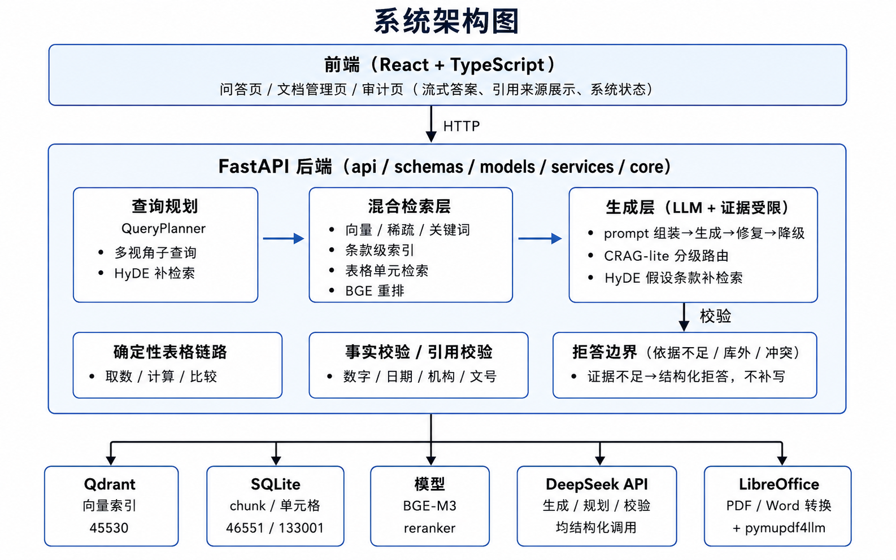

# 面向银行业监管制度与统计报表的可信 RAG 问答系统 —— 技术文档

**参赛单位：** 揭榜挂帅赛道三号赛题（南京银行）
**版本：** v2.0（2026-08-05，四阶段升级完成版）

---

## 1. 赛题理解与总体思路

### 1.1 命题背景

银行业经营管理高度依赖监管制度、业务规程、统计报表与内部操作文件。信贷
审批、风险分类、资本管理、消保投诉、反洗钱、支付结算、普惠金融与监管报送
等场景都需要快速查询制度依据与指标口径。资料分散于金融监管总局、人民银行、
政府网站等多个渠道，格式包含 Word、PDF、Excel 与网页附件，更新频繁、版本
差异明显，人工查询易漏查、误用旧规、条款定位不准、表格指标口径混淆。

### 1.2 技术挑战（命题列明的四个卡点）

1. **多源异构文档解析难**：监管原文 PDF/Word 版式差异大，统计附件以 xls/xlsx
   为主，常规切分难以保留标题层级、条款编号、表头结构、单位与时间维度；
2. **检索精度与证据定位难**：问题依赖具体条款、金额阈值、期限、适用对象、
   例外情形与附件指标，仅关键词召回易出现同名文件、旧版新规混淆，无法稳定
   返回最小充分证据；
3. **跨文件与跨模态推理难**：部分问题需同时理解制度正文与统计报表，通用
   问答模型容易跳过检索依据，产生看似合理但不可核验的答案；
4. **金融合规表达要求高**：答案需区分"应当、可以、不得、原则上"等规范强度，
   并准确呈现金额、比例、日期、机构名称与文号，细微数字或主体错误可能影响
   业务判断。

### 1.3 总体设计原则

- **确定性优先**：表格取数、表格计算、拒答边界等可程序化环节全部走确定性
  链路，不依赖 LLM 猜测；LLM 仅用于文本答案组织与语义理解；
- **证据闭环**：答案必须引用证据（条款级/段落级/表格单元级），返回前经
  事实校验（数字、日期、机构、文号、引用标签），校验失败自动修复或拒答，
  证据不足一律拒答而非补写；
- **通用能力**：所有优化均为语言/结构特征层面的通用改进，不绑定具体题目
  与文档，用评测集做回归门禁；
- **可复现**：知识库构建、评测跑测、评分全部脚本化，manifest 记录文件
  溯源信息（doc_id、SHA-256、路径）。

---

## 2. 系统架构

### 2.1 技术选型

| 组件 | 选型 | 用途 |
|---|---|---|
| 后端框架 | FastAPI + Uvicorn | API 服务（分层：api/schemas/models/services/core） |
| 向量数据库 | Qdrant 1.18 | 稠密/稀疏向量混合检索 |
| 关系存储 | SQLite（WAL） | 文档、chunk、表格单元元数据与结构化索引 |
| Embedding | BGE-M3（本地） | 稠密向量 + 稀疏向量 |
| 重排 | BGE-reranker-v2-m3（本地） | 交叉编码器精排 |
| 生成/规划 | DeepSeek API（deepseek-v4-flash） | 查询规划、答案生成、语义校验 |
| 文档解析 | python-docx / pymupdf4llm / xlrd / openpyxl / LibreOffice | Word/PDF/Excel 多格式解析 |
| 前端 | React + TypeScript + Vite | Web 客户端 |
| 部署 | Docker Compose（CPU/GPU 双配置） | 一键部署与可复现环境 |

---

## 3. 知识库构建（任务一：文档解析与索引流程）

### 3.1 多格式解析

| 格式 | 解析器 | 结构化产出 |
|---|---|---|
| .doc | LibreOffice 转换 + 结构抽取 | 段落、标题层级、条款号元数据 |
| .docx | python-docx | 段落、表格、章节结构 |
| .pdf | pymupdf4llm | 版式感知的文本段落 |
| .xls / .xlsx | xlrd / openpyxl（+LibreOffice） | sheet → 单元格（行/列标签、坐标、数值、单位、公式） |

### 3.2 结构化索引（解决"常规切分丢结构"）

- **条款级元数据**：每个 chunk 挂载 section_number、parent_section、前后邻接
  chunk、标题层级，监管"第X条"结构得以保留；
- **表格单元级索引**：Excel 附件不按文本切分，而是将每个 sheet 解析为
  133,001 个带坐标、行/列标签、单位、数值的结构化单元格，支持按指标名称、
  期间维度、机构维度精确召回与确定性取数；
- **双索引**：SQLite（元数据 + 单元格查询）与 Qdrant（向量检索）并行，
  向量索引 45,530 条。

### 3.3 入库规模与溯源

- **500 份文件**（doc 32 / docx 34 / pdf 45 / xls 232 / xlsx 157），
  **解析成功率 100%**（0 失败、0 降级）；
- 每文件在 manifest 中记录 doc_id、标题、本地路径、文件大小、SHA-256、
  解析结果（chunk/cell 数）等溯源信息；
- 全部流程脚本化：`prepare_contest_data.ps1` → `ingest_contest_dataset.py`
  → 校验 `evaluate_ingestion.py`，可一键重建与评测一致的 500 份文件知识库。

---

## 4. 检索层（任务二：可溯源问答生成能力之检索）

### 4.1 混合检索

综合**稠密向量（BGE-M3）+ 稀疏向量 + 关键词（BM25 类）+ 元数据过滤**
四路召回，RRF 融合排序；支持按文件名称、监管主题、业务领域、条款编号、
指标名称、期间维度过滤。

### 4.2 查询规划（Query Planner）

对复杂问题生成多视角子查询（aspect），分别检索后合并证据；规划超时
12 秒，失败自动降级为单查询。

### 4.3 条款级索引与定义条款定位（阶段一）

- 定义型问题（"X 是如何定义的/所称 X 是指"）先定位"所称X/ X是指"条款，
  再取该条款所在 chunk 及前后邻接，解决定义句被切碎、同概念条款错位
  （如"内部评级法"↔"权重法"附件混淆）问题；
- 检索候选按附件匹配度与章节限定词加分（`_retrieval_fit_score`）。

### 4.4 CRAG-lite 分级路由（阶段二）

生成前判断"证据是否覆盖问题要点"：
- 证据正确 → 直接生成；
- 证据缺失/模糊 → 定向补检索（文档内词面补搜、禁止性规定模式补搜、
  兜底条款通道、"哪些/包括"列表枚举条款补充），仍不足则结构化拒答；
- 生成后校验失败 → 证据受限二次生成（仅使用知识片段原文组句），再失败
  走 extractive 摘录或拒答，杜绝自由发挥。

### 4.5 HyDE 覆盖缺口补检索 + 监管文档结构图（阶段四）

- **HyDE**：规划查询全部无果的未覆盖 aspect，由 LLM 生成"假设条款"参与
  检索，缓解监管术语问法与文档措辞不匹配（每请求 ≤2 aspect、1 次 LLM 调用）；
- **文档结构图条款引用多跳**：解析"本办法第X条"引用关系，跨章节定位被引
  条款，解决跨文档/跨条款多跳推理（X 组跨文档题）。

### 4.6 确定性表格链路

表格取数/计算/比较走程序化链路：按指标名 + 期间 + 机构维度从单元格索引
取数，算术仅限安全算子且变量必须来自证据，LLM 不参与数值计算——官方 300
与自命题 200 题中**表格取数、表格计算全部 100% 通过**。

---

## 5. 生成与可信控制（答案可验证性、幻觉抑制）

### 5.1 证据受限生成

提示词强制"仅使用知识片段原文组句、逐条引用 [n] 标注来源、证据不足必须
拒答"；每条回答的 citations 携带 doc_id、chunk_id、文件名、章节与摘录，
支持条款级/段落级/表格单元级三种粒度证据返回。

### 5.2 事实校验（Grounding）

返回前对答案做确定性校验：关键数字、比例、日期、机构名称、文号必须与
证据一致；引用标签按词面重叠重定向；LLM 自由发挥的标注在校验前清理。
校验失败最多自动修复，仍失败则拒答。

### 5.3 拒答边界

依据不足、资料冲突、问题含糊、知识库外问题一律结构化拒答并给出原因——
自命题 200 题中 40 道依据不足/数据缺失题**拒答率 100%**。

---

## 6. 性能与稳定性工程

| 问题 | 根因 | 修复 |
|---|---|---|
| 并发 503（4 workers 31 个） | 模型锁串行化 + LLM 竞争 | 模型获取移出推理锁、锁等待不消耗预算、API 层瞬态重试一次 → **40 题并发 0 错误** |
| SQLite "unable to open database file" | WAL 在 bind mount 上不可靠 | 移入 named volume + 回退 DELETE 模式 + busy_timeout |
| 开放题延迟高 | CPU rerank 逐对 ~1.3s | rerank 输入 24→12、batch 16、planner/生成超时收紧（rerank 17.5s→8.9s） |
| LLM 空输出 | max_tokens 被思考耗尽 | 900→3000、attempts 4 交替流式/非流式重试 |

---

## 7. 实验设计与量化指标

### 7.1 评测体系

| 评测集 | 题量 | 评分方式 | 用途 |
|---|---|---|---|
| 官方 300 题（选择题） | 300 | 选项比对（确定性） | AGENTS.md 硬门禁，每次生产改动后回归 |
| 官方 300 开放问答（judge 口径） | 300 | LLM judge + 人工复核 | 开放式能力基线（84.7%） |
| 自命题 200 题（旧批 100 + 新批 100） | 200 | **确定性评分器**（金标逐事实比对） | 八类题型细粒度回归：定义/规则/阈值/名单/表格取数/表格计算/跨文档/拒答 |

自命题评分器为确定性程序：归一化 bigram recall ≥0.55 且关键实体
（数字/日期/文号/《文件名》）全命中、无语义极性冲突即判事实通过；证据
引用命中率按"金标要求来源文件全部出现在引用中"计算；逐题输出
passed/failure_category/facts_met/source_evidence_met/latency_ms。

### 7.2 量化指标实测（2026-08-05，0 运行错误）

| 指标 | 赛题要求 | 实测 |
|---|---:|---:|
| 官方 300 题准确率 | — | **300/300（100%）**，0 错误（多次回归一致） |
| 制度事实类准确率（自命题 200 题：定义+规则+阈值+名单） | ≥85% | **89.3%（CPU）** / 85.7%（GPU） |
| 表格取数类准确率 | ≥80% | **100%（40/40）**；官方 300 中取数 34/34、计算 33/33 |
| 证据引用命中率 | ≥90% | **91.3%（CPU）** / 91.9%（GPU） |
| 关键数字/日期/机构/文号错误率 | ≤5% | **2.4%**（按事实计） |
| 拒答/澄清率 | ≥80% | **100%（40/40）** |
| 自命题 200 题总准确率 | — | **183/200（91.5%，CPU）** / 180/200（90.0%，GPU） |

### 7.3 性能实测（单轮问答，串行，RTX 5070 Laptop / Ryzen 9 8945HX）

| 评测集 | CPU 平均 / P50 / P95 / 最大 | GPU 平均 / P50 / P95 / 最大 |
|---|---:|---:|
| 官方 300（选择题） | 7.03 / 0.26 / 32.2 / 64.2 s | **0.54 / 0.22 / 3.51 / 8.66 s** |
| 自命题 200 题（开放问答） | 28.4 / 29.8 / 72.0 / 134.6 s | **17.9 / 14.1 / 58.0 / 168.8 s** |

开放题延迟由 LLM API 生成（约 10–12 s/题）主导，GPU 将本地检索+重排从
~15 s 压到 ~3 s（平均提速 1.6 倍、P50 提速 2.1 倍）；长尾为 LLM API 偶发
慢响应（CPU/GPU 均有）。选择题大部分走确定性表格链路（P50 ~0.2 s）。

### 7.4 工程验证

- 后端单元测试 **588 passed**；
- 反硬编码审计 **0 findings**（逐批审计产物随包交付）；
- 官方 300 在四阶段升级期间 6+ 次回归均 300/300、0 错误；
- 4 workers 并发 40 题 **0 错误**（修复前 31 个 503）。

---

## 8. 迭代与失败归因（RAGAS 三层）

200 题联合评测曾卡在 87%，分层归因（context_recall / context_precision /
faithfulness）确认**瓶颈在检索层而非生成层**：≥15/26 题失败为证据拿不到
或拿错（定义条款被挤出 top-k、同概念附件错位、多文档题只检索到一份），
而校验机制可靠（无幻觉，是证据错了）。据此实施四阶段升级：

| 阶段 | 内容 | 效果 |
|---|---|---|
| 一 | 条款级索引 + 定义条款定位 + 附件/章节限定加权 | 定义类 26/30→29/30，错位题恢复 |
| 二 | CRAG-lite 分级路由 + 列表完整性补搜 + 引用修复 | 拒答边界修复，B2-R10 0/4→4/5 |
| 三 | 并发 503 修复 + 延迟优化 | 40 题并发 0 错误，rerank 减半 |
| 四 | HyDE 覆盖缺口补检索 + 条款引用多跳 | BW-D12/B2-L01 从拒答/0/5 恢复 |
| 合计 | — | **200 题 87% → 91.5%（CPU）**，官方 300 保持 300/300 |

---

## 9. 创新点总结

1. **条款级索引 + 定义条款定位**：监管文档按"第X条"结构索引，定义型问题
   先定位定义条款再取上下文，解决条款错位与定义句切碎；
2. **CRAG-lite 分级路由**：生成前"证据-问题"相关性判断，证据缺失自动定向
   补检索（禁止性规定、兜底条款、列表枚举等模式），而非直接生成；
3. **HyDE 覆盖缺口补检索 + 监管文档结构图**：假设条款检索 + "本办法第X条"
   引用图多跳，解决跨文档/跨条款推理；
4. **确定性表格链路**：133,001 单元格结构化索引 + 程序化取数/计算，
   表格类题目 100% 准确且毫秒级返回；
5. **证据闭环校验**：数字/日期/机构/文号/引用标签确定性校验 + 证据受限
   二次生成 + 结构化拒答，实体错误率 2.4%、拒答率 100%、证据引用命中率 91%+。

---

## 10. 复现说明与已知限制

### 10.1 复现

见代码提交包 README.md 与 `data/自命题200题评测集/README.md`：
一键构建镜像 → 一键入库 500 文件 → 官方 300 回归 → 自命题 200 题跑测评分。
知识库重建后与评测环境一致（manifest SHA-256 可校验）。

### 10.2 已知限制（如实说明）

- **LLM 生成波动**：同代码重复运行准确率波动 ±1–3 题（文本生成题）；
- **跨文档题仍偏弱**：8 题中 3–4 题通过（金标要求多文件引用时生成层
  对比结论偶有缺漏）；
- **开放题延迟长尾**：LLM API 偶发慢响应（最大 ~170 s），本地计算非瓶颈；
- **官方 300 开放问答（judge 口径）84.7%**：低于选择题 100%，属开放式
  生成口径，选择题（官方硬门禁）与自命题确定性评分均已达标。
