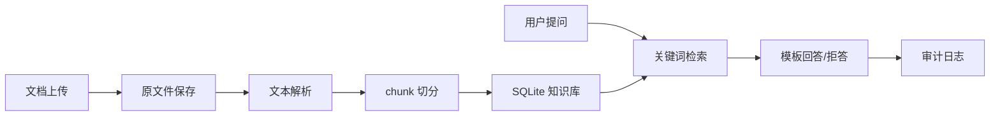

# FilingSentry Agent：面向银行监管制度与统计报表的可信 RAG 问答系统

## 1. 当前项目定位

FilingSentry Agent 当前阶段只做一件事：面向银行监管制度、填报说明、统计指标口径文档的可信 RAG 问答。

系统目标是：

1. 用户上传制度、填报说明、指标口径文档。
2. 后端解析文档并切分为 chunk。
3. 用户提问时，系统先检索知识库。
4. 有依据时只基于引用片段回答。
5. 没有足够依据时明确拒答。
6. 上传、入库、问答、拒答都写入审计日志。

当前阶段不是报表校验系统，也不是 Agent 排查系统。

## 2. 当前保留功能

| 功能 | 说明 |
| --- | --- |
| 健康检查 | `GET /api/health` |
| 文档上传 | 上传 txt/md/docx/pdf |
| 文档列表 | 查看已入库文档和 chunk 数 |
| 文档详情 | 查看 chunk 摘要 |
| 可信问答 | 基于检索片段回答并返回 citations |
| 无依据拒答 | 知识库无命中时固定拒答 |
| 审计日志 | 记录上传、入库、问答、拒答 |
| 前端托管 | FastAPI 托管 React 构建产物 |

## 3. 当前删除功能

以下能力已经从当前代码主线删除：

- `/api/reports/*`
- `/api/findings/*`
- `/api/reviews`
- 报表格式校验。
- 报表勾稽规则。
- `STAT_BALANCE_DEMO`。
- finding 异常详情。
- 人工复核。
- 审查报告。
- Tool Calling。
- Agent 排查流程。

这些内容可以作为未来扩展重新设计，但不能继续污染当前 RAG-only 主线。

## 4. 技术栈

- 后端：Python + FastAPI + Pydantic + SQLAlchemy + SQLite + Uvicorn
- 前端：React + TypeScript + Vite
- 文档解析：txt / md / docx / 可提取文本的 pdf
- RAG 检索：第一版使用关键词重叠评分，不接向量数据库
- 回答生成：第一版使用模板回答，不接真实 LLM
- 测试：pytest + 前端 TypeScript build

## 5. 当前系统架构



## 6. 后端模块

| 模块 | 作用 |
| --- | --- |
| `api/documents.py` | 文档上传、列表、详情 |
| `api/qa.py` | 可信问答 |
| `api/audit.py` | 审计日志 |
| `core/database.py` | SQLite 连接和建表 |
| `models/document.py` | 文档、chunk、问答日志表 |
| `models/audit.py` | 审计日志表 |
| `services/document_storage.py` | 保存上传文件和生成 document_id |
| `services/document_parser.py` | 解析 txt/md/docx/pdf |
| `services/chunk_service.py` | 切分 chunk |
| `services/rag_service.py` | 检索、回答、拒答 |
| `services/audit_service.py` | 记录审计 |

## 7. 前端页面

| 页面 | 路径 | 作用 |
| --- | --- | --- |
| 工作台 | `/` | 展示健康状态、知识库统计、最近文档、最近问答入口 |
| 知识库 | `/documents` | 上传监管文档、查看文档列表 |
| 可信问答 | `/qa` | 提问、展示回答、引用、拒答状态 |
| 审计日志 | `/audit` | 查看上传、入库、问答、拒答记录 |

## 8. API 契约

当前公开接口：

```text
GET  /api/health
POST /api/documents/upload
GET  /api/documents
GET  /api/documents/{document_id}
POST /api/qa/ask
GET  /api/audit/logs
```

问答接口必须返回：

- `answer`
- `citations`
- `confidence`
- `refused`

无依据时固定回答：

```text
知识库中未找到足够依据，无法给出确定回答。
```

## 9. 开发顺序

### Day 1：RAG-only 重构

- 删除报表校验旧主线。
- 引入 SQLite + SQLAlchemy。
- 实现文档上传、解析、切块。
- 实现关键词检索和模板回答。
- 实现审计日志。
- 替换前端页面。
- 更新文档和 README。

### Day 2：RAG 质量增强

- 改进中文关键词提取。
- 增加更清楚的 chunk 标题识别。
- 增加引用片段高亮。
- 增加知识库统计。
- 增加更多 API 测试。

### Day 3：接入真实 LLM

- 在 `rag_service.answer_question()` 后接入模型调用。
- 保持 citations 作为唯一依据。
- 增加“回答不得超出引用范围”的 guardrail。
- 无 citations 时仍然拒答，不调用模型编造。

### Day 4：向量检索评估

- 评估是否需要 embedding。
- 如需要，先写清楚索引路径、刷新方式、模型选择和测试集。
- 不直接引入重型向量数据库。

## 10. 学习重点

当前阶段你需要重点理解：

- FastAPI 路由和 Pydantic schema 如何配合。
- SQLAlchemy model 如何映射 SQLite 表。
- 上传文件如何保存到本地。
- 文档解析为什么要和文档保存分开。
- chunk 为什么要保存来源信息。
- RAG 为什么必须返回 citations。
- 为什么无依据时必须拒答。
- 前端如何通过 API client 调后端。
- 为什么前端不能自己编造结果。

## 11. 测试计划

每次提交前至少运行：

```powershell
.\.venv\Scripts\python.exe -m pytest
cd frontend
npm run build
```

当前验收场景：

- 健康检查正常。
- 上传 txt 文档成功并生成 chunk。
- 上传空文档返回 400。
- 文档列表可返回已入库文档。
- 命中知识库的问题返回 answer 和 citations。
- 未命中问题 `refused=true`。
- 审计日志能看到上传、入库、问答、拒答记录。
- 前端构建通过。

## 12. 风险控制

| 风险 | 控制方式 |
| --- | --- |
| RAG 编造 | 无 citations 时拒答 |
| 引用不可信 | citations 返回 document_id、chunk_id、filename、section_title、page_number、excerpt |
| 检索质量弱 | 先用测试问题评估，再决定是否引入 embedding |
| 数据泄露 | 不提交运行时上传文件和数据库 |
| 范围膨胀 | 当前阶段不做报表校验、Agent、复核 |
| 前后端字段不一致 | 以 API 文档和 TypeScript 类型为准 |

## 13. 未来扩展

未来可以按这个顺序扩展：

1. 接入真实 LLM。
2. 引入 embedding 检索。
3. 增加制度文档管理能力。
4. 增加多轮追问。
5. 增加回答质量评估集。
6. 重新设计报表校验和 Agent 排查。

未来扩展原则：

> 先把可信 RAG 做稳，再考虑 Agent；先让引用可信，再让模型聪明。
